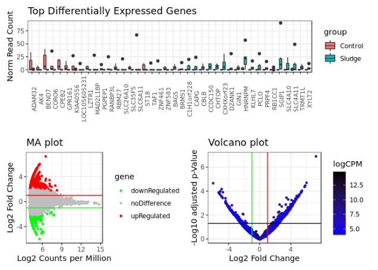

# NanoFlow

<!-- HEADER -->
<br />
<p align="center">
  <h3 align="center">Nanopore cDNA Sequencing Analysis Workflow</h3>
  <p align="center">
    Workflow to take fastq files from Nanopore cDNA sequencing to DEG lists and more.
    <br />
  </p>
</p>


<!-- TABLE OF CONTENTS -->
<details open="open">
  <summary><h2 style="display: inline-block">Table of Contents</h2></summary>
  <ol>
    <li><a href="#about">About</a></li>
    <li><a href="#getting-started">Getting Started</a>
      <ul>
        <li><a href="#requirements">Requirements</a></li>
        <li><a href="#installation">Installation</a></li>
      </ul>
    </li>
    <li><a href="#usage">Usage</a></li>
  </ol>
</details>

<!-- ABOUT -->
## About

This is my attempt at streamlining the pipeline for Nanopore cDNA sequencing analysis.
The current version (v0.1) is mostly code ripped from other people (that for some reason did not work for me) bolted together until, like Frankenstein, my monster came to life!!!

Given fastq files, a reference transcriptome, and an annotation file, this workflow will process the reads, align, count, and analyse for differential expression. Along with handy csv files you will also receive html reports which contain loads of analytics for quality control and overall assessment of the success of your sequencing and analysis

Top differentially expressed genes between your groups.
<p align="center">
  <a href="https://github.com/lab-rat-kid/NanoFlow">
    
  </a>
</p>

Various pre-set graphs covering the entire dataset.
<p align="center">
  <a href="https://github.com/lab-rat-kid/NanoFlow">
    
  </a>
</p>

I've also included some R code which will take the output from the workflow and can be easily edited to examine various sets of genes closely.

I will be overhauling in the future to something that does the exact same things...but in my own way. I also want to venture into wrapping this all within a linux programme so it can be called with args completely from the command line.


<!-- GETTING STARTED -->
## Getting Started

To get a local copy up and running follow these simple steps.

### Requirements

* Linux
* Anaconda

### Installation

1. Create a directory and clone the repo
   ```sh
   mkdir NanoFlow
   cd NanoFlow
   git clone https://github.com/lab-rat-kid/NanoFlow.git
   ```
2. Extract packages and create environment
   ```sh
   tar -xf NanoFlow.tar.gz
   conda env create --name NanoFlow --file environment.yaml
   ```

<!-- USAGE EXAMPLES -->
## Usage

1. Move fastq files into `RawData` folder

2. Move reference files into `ReferenceData` folder

3. Modify the file `config.yaml` 

4. Modify the file `NanoFlow.sh`

5. Double check `config.yaml` and `NanoFlow.sh` are both amended correctly

6. Activate environment and run
   ```sh
   conda activate NanoFlow
   ./NanoFlow.sh
   ```